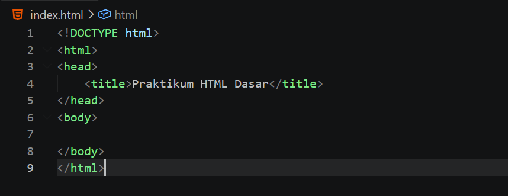
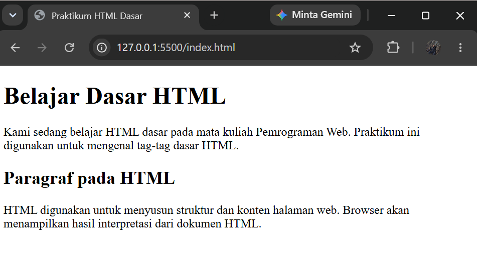
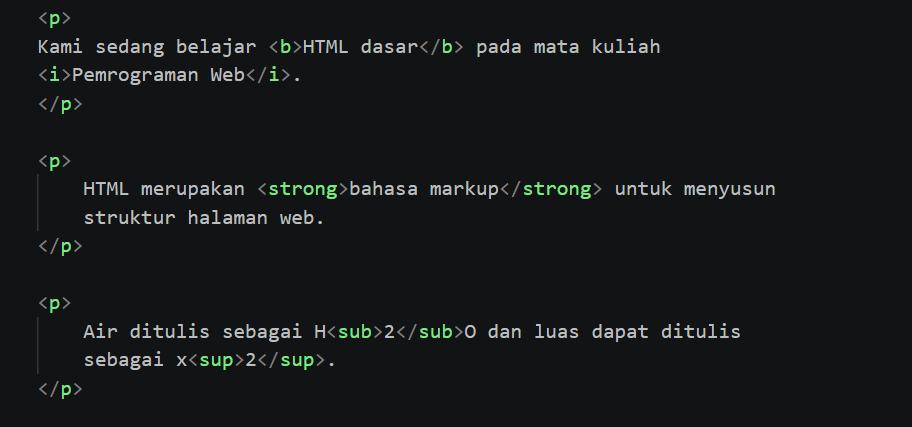
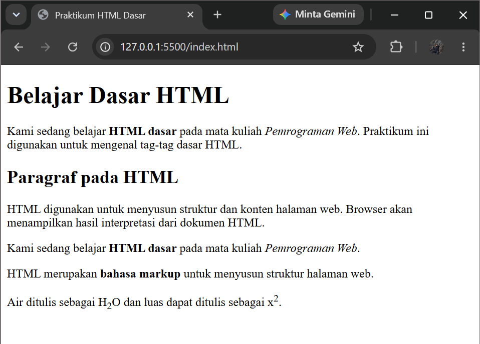
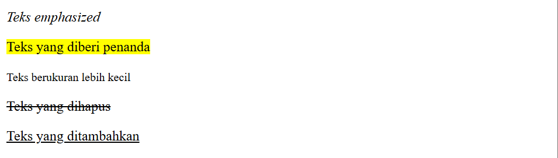
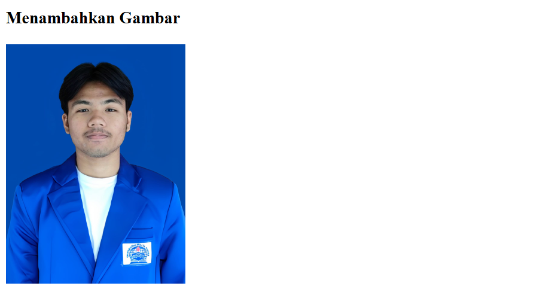
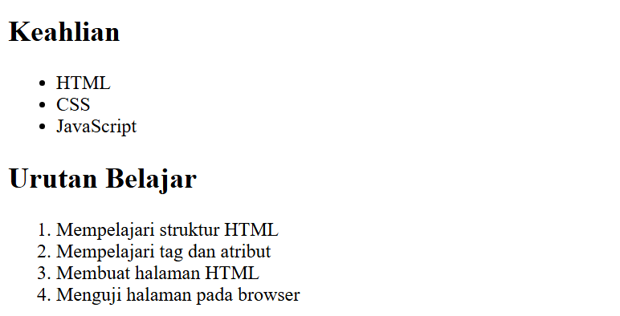
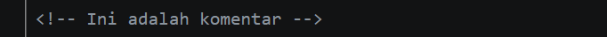
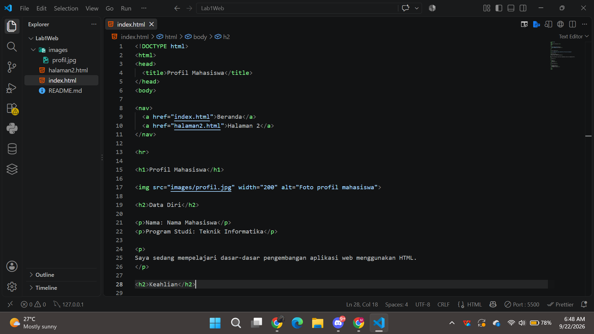

# Praktikum 1 - HTML Dasar

## Identitas Mahasiswa

**Nama:** M.Fahmi Abdul Basith
**NIM:** 312510260
**Kelas:** I251C
**Mata Kuliah:** Pemrograman Web

---

# Praktikum 1 - HTML Dasar

Praktikum ini membahas dasar-dasar HTML, mulai dari pembuatan struktur dasar HTML5, paragraf, heading, pemformatan teks, gambar, hyperlink, list, komentar HTML, hingga menggabungkan seluruh elemen menjadi sebuah halaman Profil Mahasiswa.

---

## Latihan 1 - Pembuatan Dasar HTML5

Pada latihan pertama saya membuat struktur dasar dokumen HTML5 menggunakan deklarasi `<!DOCTYPE html>`, elemen `<html>`, `<head>`, `<title>`, dan `<body>`.

Struktur dasar HTML5 digunakan sebagai kerangka awal dalam pembuatan sebuah halaman web.

### Screenshot Kode di VS Code



---

## Latihan 2 - Membuat Paragraf

Pada latihan kedua saya membuat beberapa paragraf sederhana menggunakan tag `<p>`.

Tag `<p>` digunakan untuk membuat paragraf pada halaman HTML.

### Screenshot Kode di VS Code


### Screenshot Hasil di Browser


---

## Latihan 3 - Menambahkan Judul

Pada latihan ketiga saya menambahkan judul dan subjudul menggunakan heading `<h1>` dan `<h2>`.

Tag `<h1>` digunakan sebagai judul utama, sedangkan `<h2>` digunakan sebagai subjudul.

### Screenshot Kode di VS Code


### Screenshot Hasil di Browser



---

## Latihan 4 - Memformat Teks

Pada latihan keempat saya melakukan pemformatan teks menggunakan beberapa tag HTML seperti `<b>`, `<i>`, `<strong>`, `<sub>`, dan `<sup>`.

Saya juga mencoba beberapa tag pemformatan lainnya seperti `<em>`, `<mark>`, `<small>`, `<del>`, dan `<ins>`.

### Screenshot Kode di VS Code



### Screenshot Hasil di Browser



### Screenshot Uji Coba di Browser



### Screenshot Uji Coba


---

## Latihan 5 - Menambahkan Gambar

Pada latihan kelima saya menambahkan gambar ke dalam halaman HTML menggunakan tag ``.

Gambar disimpan di dalam folder `images` dan dipanggil menggunakan atribut `src`.

Saya juga menggunakan atribut `alt` dan `title` pada gambar.

### Screenshot Kode di VS Code


### Screenshot Hasil di Browser



---

## Latihan 6 - Mengubah Ukuran Gambar

Pada latihan keenam saya mengubah ukuran gambar menggunakan atribut `width` dan `height`.

Pengaturan ukuran digunakan agar gambar dapat ditampilkan sesuai dengan ukuran yang diinginkan.

### Screenshot Kode di VS Code


### Screenshot Hasil di Browser


---

## Latihan 7 - Membuat Hyperlink

Pada latihan ketujuh saya membuat hyperlink menggunakan tag `<a>` dengan atribut `href`.

Hyperlink yang dibuat meliputi link menuju halaman internal dan link menuju website eksternal.

Saya juga membuat file `halaman2.html` sebagai halaman tujuan hyperlink internal.

### Screenshot Kode di VS Code


### Screenshot Hasil di Browser


### Screenshot Halaman 2


---

## Latihan 8 - Membuat List

Pada latihan kedelapan saya membuat daftar menggunakan dua jenis list HTML, yaitu:

- Unordered List menggunakan tag `<ul>`
- Ordered List menggunakan tag `<ol>`

Unordered list digunakan untuk membuat daftar tanpa nomor, sedangkan ordered list digunakan untuk membuat daftar yang berurutan.

### Screenshot Kode di VS Code


### Screenshot Hasil di Browser



---

## Latihan 9 - Menambahkan Komentar HTML

Pada latihan kesembilan saya menambahkan komentar HTML menggunakan format:

`<!-- komentar -->`

Komentar digunakan untuk memberikan penanda atau informasi tambahan pada kode HTML dan tidak ditampilkan pada halaman browser.

### Screenshot Kode di VS Code



---

## Latihan 10 - Menggabungkan Semua Elemen

Pada latihan kesepuluh saya menggabungkan elemen-elemen HTML yang telah dipelajari sebelumnya menjadi sebuah halaman Profil Mahasiswa.

Halaman tersebut terdiri dari:

- Navigasi
- Judul halaman
- Foto profil
- Data diri
- Keahlian
- Target belajar
- Unordered list
- Ordered list

### Screenshot Kode di VS Code



### Screenshot Hasil di Browser


---

# Struktur Repository

Struktur repository yang digunakan dalam praktikum ini adalah:

```text
Lab1Web/
├── images/
│   └── profil.jpg
├── index.html
├── halaman2.html
└── README.md
