## Identitas Mahasiswa

**Nama:** M. Fahmi Abdul Basith  
**NIM:** 312510260  
**Kelas:** I251C  
**Mata Kuliah:** Pemrograman Web

---

# Praktikum 1 - HTML Dasar

Praktikum ini membahas dasar-dasar HTML, mulai dari pembuatan struktur dasar HTML5, paragraf, heading, pemformatan teks, gambar, hyperlink, list, komentar HTML, hingga menggabungkan seluruh elemen menjadi sebuah halaman Profil Mahasiswa.

---

## Latihan 1 - Pembuatan Dasar HTML5

Pada latihan pertama saya membuat struktur dasar dokumen HTML5 menggunakan deklarasi `<!DOCTYPE html>`, elemen `<html>`, `<head>`, `<title>`, dan `<body>`.

Struktur dasar HTML5 digunakan sebagai kerangka awal dalam pembuatan sebuah halaman web.

### Screenshot Kode di VS Code


---

## Latihan 2 - Membuat Paragraf

Pada latihan kedua saya membuat beberapa paragraf sederhana menggunakan tag `<p>`.

Tag `<p>` digunakan untuk membuat paragraf pada halaman HTML.

### Screenshot Kode di VS Code

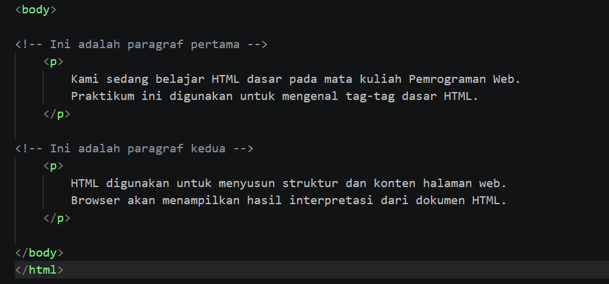

### Screenshot Hasil di Browser

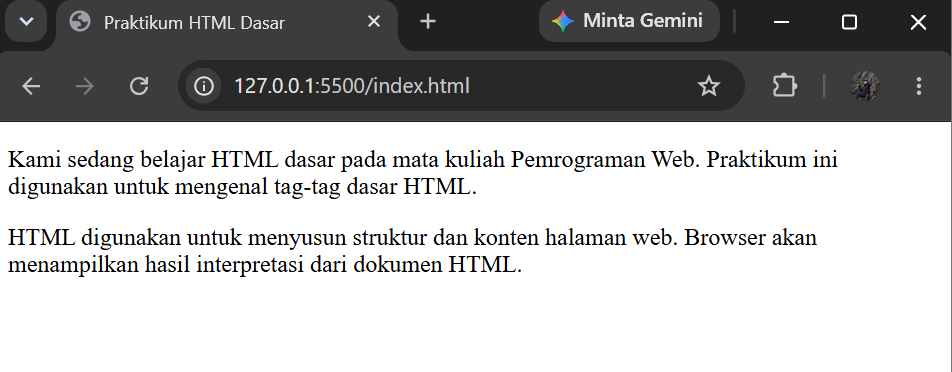

---

## Latihan 3 - Menambahkan Judul

Pada latihan ketiga saya menambahkan judul dan subjudul menggunakan heading `<h1>` dan `<h2>`.

Tag `<h1>` digunakan sebagai judul utama, sedangkan `<h2>` digunakan sebagai subjudul.

### Screenshot Kode di VS Code

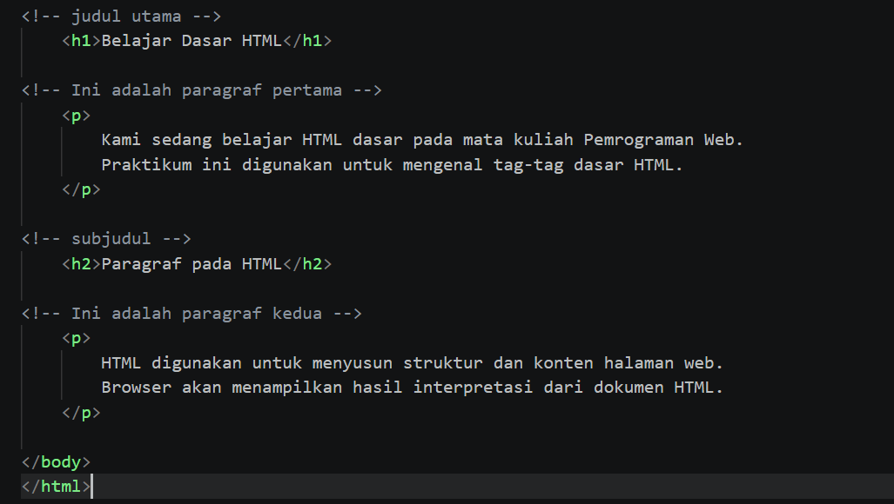

### Screenshot Hasil di Browser


---

## Latihan 4 - Memformat Teks

Pada latihan keempat saya melakukan pemformatan teks menggunakan beberapa tag HTML seperti `<b>`, `<i>`, `<strong>`, `<sub>`, dan `<sup>`.

Saya juga mencoba beberapa tag pemformatan lainnya seperti `<em>`, `<mark>`, `<small>`, `<del>`, dan `<ins>`.

### Screenshot Kode di VS Code


### Screenshot Hasil di Browser


### Screenshot Uji Coba di Browser


### Screenshot Uji Coba

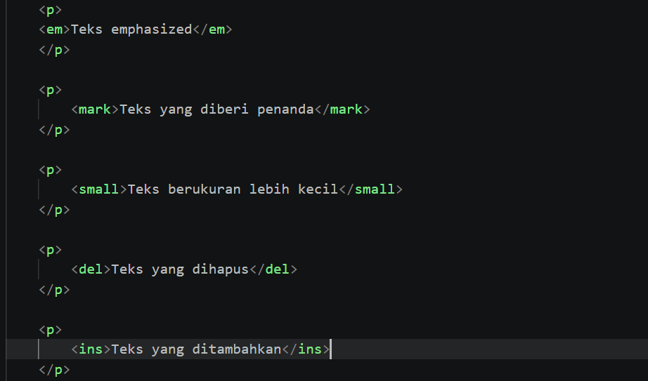

---

## Latihan 5 - Menambahkan Gambar

Pada latihan kelima saya menambahkan gambar ke dalam halaman HTML menggunakan tag ``.

Gambar disimpan di dalam folder `images` dan dipanggil menggunakan atribut `src`.

Saya juga menggunakan atribut `alt` dan `title` pada gambar.

### Screenshot Kode di VS Code

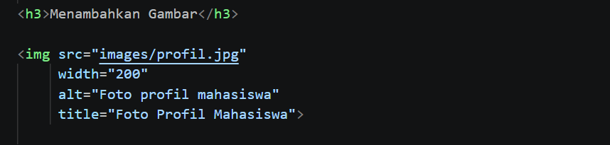

### Screenshot Hasil di Browser


---

## Latihan 6 - Mengubah Ukuran Gambar

Pada latihan keenam saya mengubah ukuran gambar menggunakan atribut `width` dan `height`.

Pengaturan ukuran digunakan agar gambar dapat ditampilkan sesuai dengan ukuran yang diinginkan.

### Screenshot Kode di VS Code

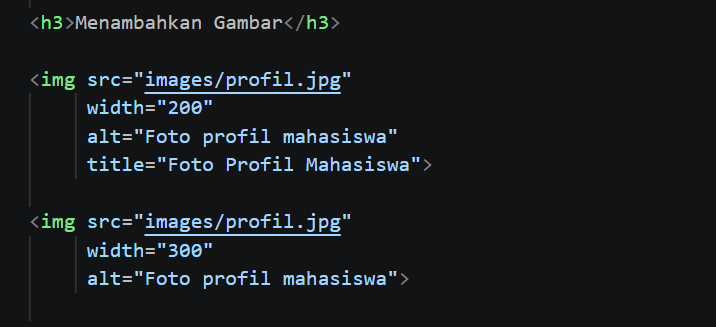

### Screenshot Hasil di Browser

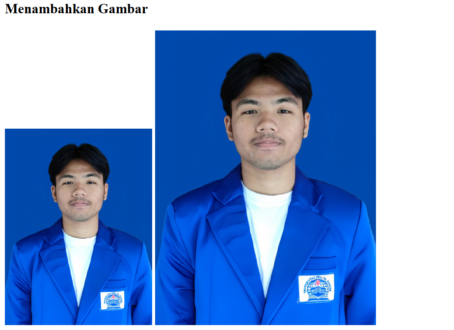

---

## Latihan 7 - Membuat Hyperlink

Pada latihan ketujuh saya membuat hyperlink menggunakan tag `<a>` dengan atribut `href`.

Hyperlink yang dibuat meliputi link menuju halaman internal dan link menuju website eksternal.

Saya juga membuat file `halaman2.html` sebagai halaman tujuan hyperlink internal.

### Screenshot Kode di VS Code

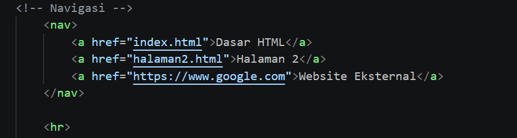

### Screenshot Hasil di Browser

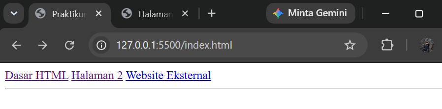

### Screenshot Halaman 2

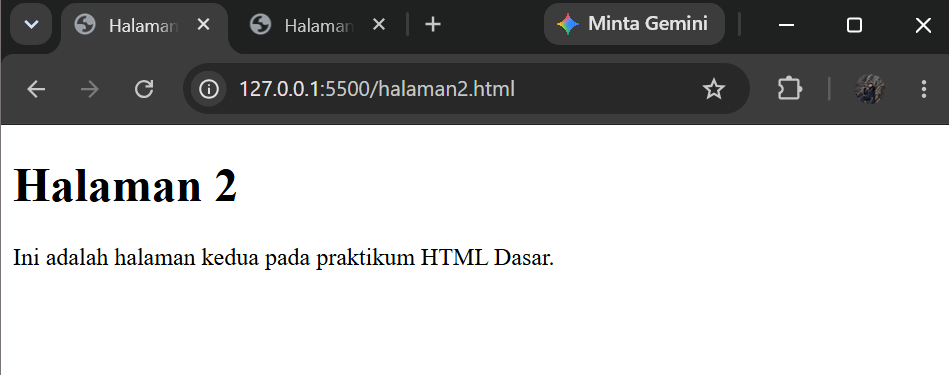

---

## Latihan 8 - Membuat List

Pada latihan kedelapan saya membuat daftar menggunakan dua jenis list HTML, yaitu:

- Unordered List menggunakan tag `<ul>`
- Ordered List menggunakan tag `<ol>`

Unordered list digunakan untuk membuat daftar tanpa nomor, sedangkan ordered list digunakan untuk membuat daftar yang berurutan.

### Screenshot Kode di VS Code

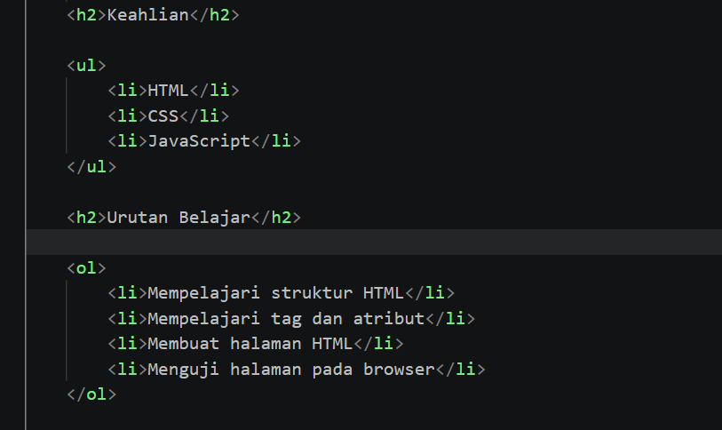

### Screenshot Hasil di Browser


---

## Latihan 9 - Menambahkan Komentar HTML

Pada latihan kesembilan saya menambahkan komentar HTML menggunakan format:

`<!-- komentar -->`

Komentar digunakan untuk memberikan penanda atau informasi tambahan pada kode HTML dan tidak ditampilkan pada halaman browser.

### Screenshot Kode di VS Code


---

## Latihan 10 - Menggabungkan Semua Elemen

Pada latihan kesepuluh saya menggabungkan elemen-elemen HTML yang telah dipelajari sebelumnya menjadi sebuah halaman Profil Mahasiswa.

Halaman tersebut terdiri dari:

- Navigasi
- Judul halaman
- Foto profil
- Data diri
- Keahlian
- Target belajar
- Unordered list
- Ordered list

### Screenshot Kode di VS Code


### Screenshot Hasil di Browser

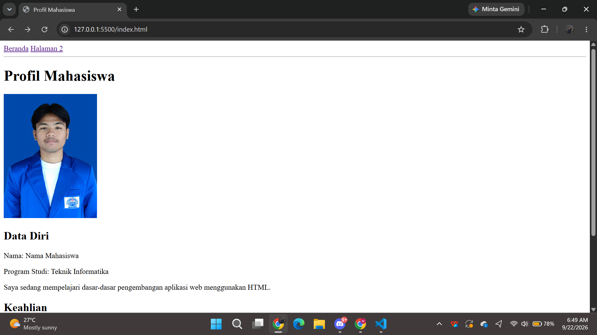

---

# Struktur Repository

Struktur repository yang digunakan dalam praktikum ini adalah:

```text
Lab1Web/
├── images/
│   └── profil.jpg
├── index.html
├── halaman2.html
└── README.md

```

# Jawab Pertanyaan Berikut

1. Apa fungsi deklarasi `<!DOCTYPE html>` pada dokumen HTML?
2. Apa perbedaan antara tag, elemen, dan atribut pada HTML?
3. Apa perbedaan `<p>` dengan `<br>`? Jelaskan penggunaannya.
4. Apa fungsi atribut `href` pada tag `<a>`?
5. Apa perbedaan hyperlink ke halaman internal dengan hyperlink ke website eksternal?
6. Apa fungsi atribut `src` dan `alt` pada tag ``?
7. Apa perbedaan penggunaan `<ul>` dan `<ol>`?
8. Apa yang terjadi jika path gambar pada atribut `src` salah?
9. Mengapa struktur heading h1 sampai h6 perlu digunakan secara terstruktur?
10. Apa fungsi komentar `<!-- ... -->` dalam kode HTML?

---

# Jawaban

1. Menyatakan dokumen menggunakan standar HTML.

2. Tag adalah penanda pembuka dan penutup sebuah elemen HTML.  
   Elemen adalah komponen yang menyusun dokumen HTML dan dapat terdiri dari tag pembuka, isi, dan tag penutup.  
   Atribut memberikan informasi tambahan kepada sebuah elemen dan biasanya ditulis pada tag pembuka.

3. `<p>` digunakan untuk membuat paragraf, sedangkan `<br>` digunakan untuk membuat perpindahan baris.

4. `href` digunakan untuk menentukan alamat atau URL yang menjadi tujuan hyperlink.

5. Hyperlink internal menghubungkan halaman dalam website atau project yang sama, sedangkan hyperlink eksternal menghubungkan ke website lain.

6. `src` digunakan untuk menentukan lokasi gambar yang ditampilkan, sedangkan `alt` memberikan deskripsi pada gambar.

7. `<ul>` digunakan untuk membuat daftar yang tidak berurutan, sedangkan `<ol>` digunakan untuk membuat daftar yang berurutan.

8. Gambar tidak akan muncul di browser saat program dijalankan karena data atau lokasi gambar tidak ditemukan.

9. Penggunaan heading secara terstruktur membantu menyusun hierarki judul dan subjudul dalam dokumen HTML.

10. Komentar digunakan untuk memberikan informasi atau penanda pada kode. Komentar tidak ditampilkan oleh browser.